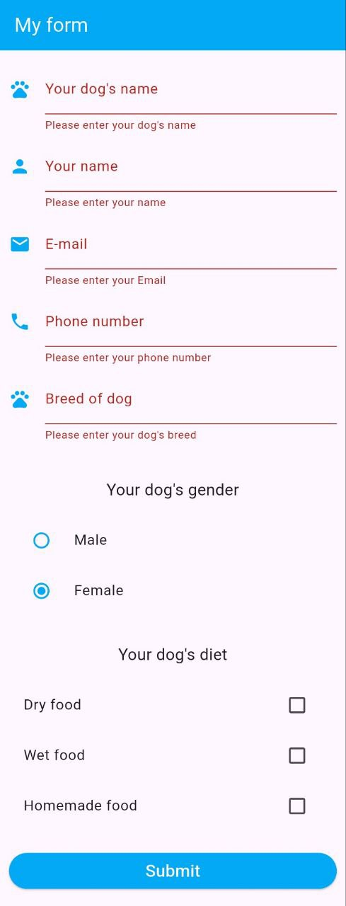
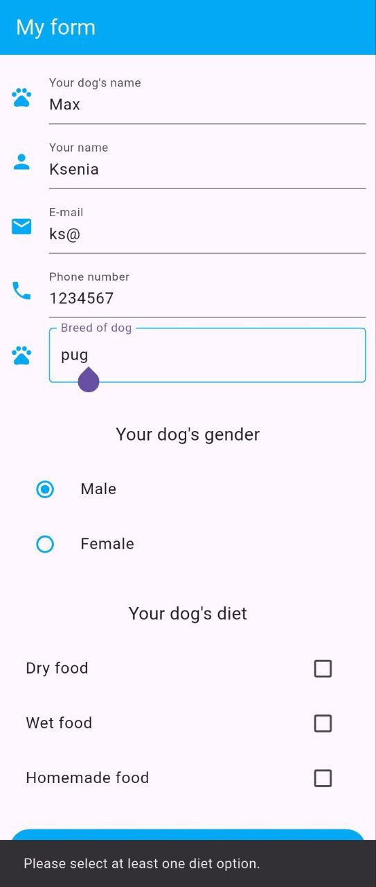
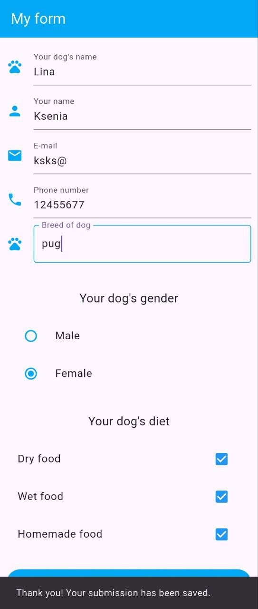

# Dog Registration Form 

A simple Flutter application for dog registration, allowing users to enter a dog's name, breed, owner details, select gender, and dietary preferences.  

# Features  
- Input fields for dog's name, breed, owner name, phone number, and email  
- Gender selection (RadioListTile)  
- Dietary preference selection (CheckboxListTile)  
- Form validation  
- Submit button with a confirmation message
 
# Preview

  
  
  

